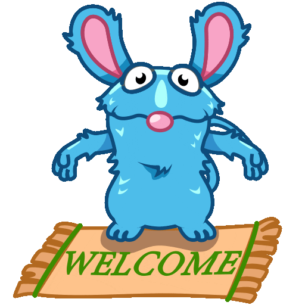
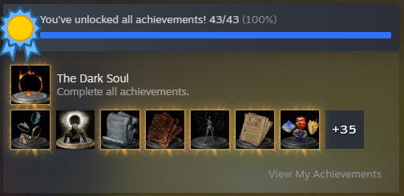

#  I'm TechTutter, but they call me **Federico**

  
  

Fullstack Software Engineer (MSc Computer Engineering & AI) currently building the future of physical therapy at **[Akina](https://www.akina.health/en/home)**. I build robust, scalable architectures by day and experiment with AI-driven workflows by night. 

I’m a **Generalist by design**: I navigate from pixel-perfect React UIs down to API design and integration, and GCP deployment pipelines.

---

### 🚀 Highlighted Projects

<table width="100%">
  <tr>
      <td width="33%" align="center" valign="top">
      <b>🏠 Domotics App (BSc)</b>
       
      Raspberry Pi-based home automation system from my final BSc project.
        
      <a href="https://github.com/TechTutter/raspberry-domotics-app"><b>View Repo →</b></a>
    </td>
    <td width="33%" align="center" valign="top">
      <b>🔍 RAG System</b>
       
      AI-driven document intelligence built with Python, LangChain, and Vector DBs.
        
      <a href="https://github.com/TechTutter/rag-project"><b>View Repo →</b></a>
    </td>

  </tr>
</table>

---

### ⚔️ Engineering Grit

To me, engineering is about solving the "unsolvable" and staying until the job is done. This completionist mindset is best summarized by my steam library:

  
   
  <i>"Don't you dare go hollow." — Dark Souls III 100% Completionist mindset.</i>

---

### 🛠️ Technical Ecosystem

Moving beyond just tools, I focus on building cohesive digital experiences with a clean, typed codebase.

| Domain | Expertise | &nbsp;&nbsp;&nbsp;&nbsp;&nbsp;&nbsp;&nbsp;&nbsp;&nbsp;&nbsp;&nbsp;&nbsp;&nbsp;&nbsp;&nbsp;&nbsp;&nbsp;&nbsp;&nbsp;&nbsp;&nbsp;&nbsp;&nbsp;&nbsp;&nbsp;&nbsp;&nbsp;&nbsp;&nbsp;&nbsp;&nbsp;&nbsp; |
| :--- | :--- | :--- |
| **Frontend** | `Typescript` `React` `Tailwind` `Vite` |  |
| **Backend** | `Python` `FastAPI` `Node.js` `Postgres` |  |
| **Cloud & Ops** | `GCP` `Docker` `Git` `Linux` |  |
| **AI Lab** | `LLMs` `RAG Architectures` `Vector DBs` |  |

---

### 📊 Growth Dashboard

<table width="100%">
  <tr>
    <td width="55%" align="center" valign="top">
      
    </td>
    <td width="45%" align="center" valign="top">
      
    </td>
  </tr>
</table>

---

### 📫 Let's Connect

I'm always open to discussing system design, AI agents, or why DS3 is the best in the series.

- **Check my work:** [federicolorrai.it](https://federicolorrai.it)
- **Get in touch:** [federicolorrai](https://www.linkedin.com/in/federicolorrai/)

---

  
   
  Profile (and life) is always a Work in Progress 🛠️

### 📜 Credits

  <a href="https://chpic.su/en/stickers/TutterMouse/">Tutter Stickers</a> retrieved from Chpic.su.

